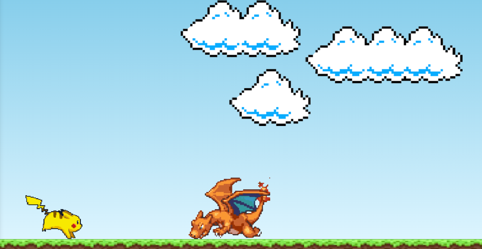
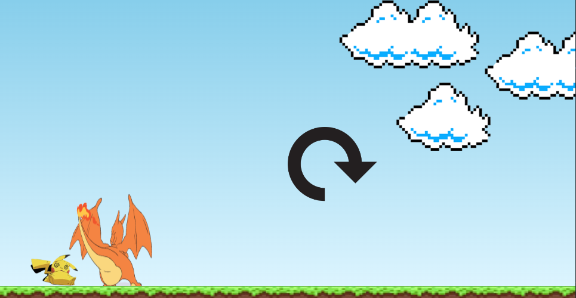

# Jump Game

# Descrição
Este projeto consiste na criação de um jogo, baseado no do dinossauro do Chrome.  
Nele você controla seu personagem com uma ação de pulo, desviando do obstáculo a sua frente.  
Caso você enconste no obstáculo, você perde.

Melhorias do projeto original:
<ul>
  <li>Botão de reload, após perder é possível reiniciar um novo jogo.</li>
</ul>

# Layout do Projeto

  
  

# Tecnologias Utilizadas

<ul>
  <li>HTML 5</li>
  <li>CSS 3</li>
  <li>JavaScript</li>
</ul>

# Autor
José Ricardo Chies Gonçalves

LinkedIn:
https://www.linkedin.com/in/ricardo-chies-087557216/

E-mail:
chies.dev@gmail.com

# Créditos
Projeto Baseado em um vídeo no Youtube do canal:  
Manual do Dev  
https://www.youtube.com/@ManualdoDev
